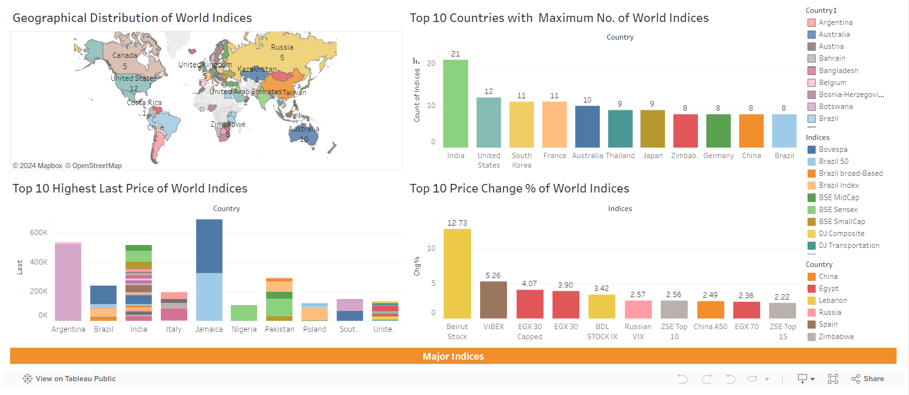
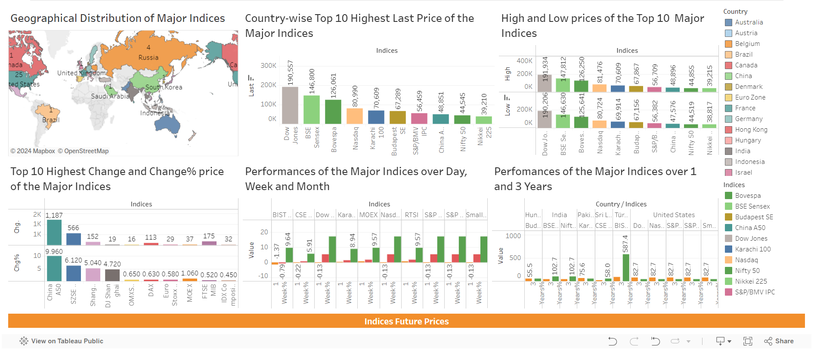
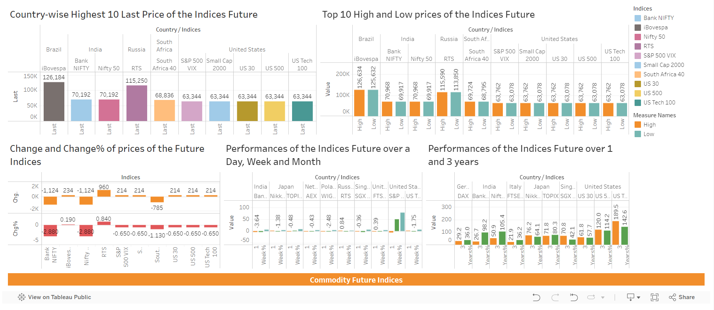
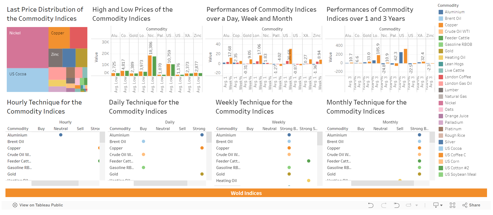

# Stock-Market-Indices-Analyses
The data has been colleted from [Investing.com](https://www.investing.com/). Around 629 data has been collected for different categories of market.

## Problem statement:
The project aims to collect data of the indices of different categories of market from [this website](https://www.investing.com/indices/world-indices).
Then the collected data is utilized to analyze the market indices and visualize the following correlations using Tableau Dashboards:

1. Analyze the geographical distribution of indices. Compare indices from different region and visualize them.
2. Major world market indices and their performance over time. Visualize how indices changed over days, months and years.
3. Analyze future indices and visualize their performance over days, months and years.
4. Analyze the real time commodity futures prices, their performances and technique and visualize with charts.

You can visit the dashboards [here](https://public.tableau.com/app/profile/kaniz.fatema.nabila/viz/CommodityFutureIndices/WorldIndices)


## Some Interesting Findings from the Analysis


1. **India** has the **maximum** number of **world indices** which is **21**.<br/>



2. **The United States** have the **maximum** number of **major indices**.<br/>
3. The **highest** last price belongs to **Dow Jones** from The United States.<br/>
4. **China A50** experiencing the **highest** change of indices prices.<br/>
5. The **performances** of the indices of **the United States** over a week and month are the **highest**.<br/>
6. The **performances** of **BIST 100** from Turkey over **1** and **3 years** are the **highest** of all other major indices which are about **90.1%** and **587.4%** respectively. <br/>



7. **iBovespa** from Brazil is to be the future indice with the **highest** price which is around **$126,184**.<br/>
8. **DAX** and **TecDAX** from Germany will experience the **highest** percentage of change in future among the other indices.<br/>
8. The **performances** of **S&P 500 VIX** over the next **week** and **month** is to be the **highest**.<br/>
9. The **performances** of **US Tech 100** over the next **1** and **3 years** is to be the **highest**.<br/>



10. For the time being **Nickel** is the commodity with the **highest** price followed by **US Cocoa**.<br/>
11. The **average performances** over a **day**, **week** and **month** and over **1** and **3 years** is the **highest** for **US Cocoa**.<br/>
     
## Build from sources and run the web scrapers
1. Clone the repository
   ```bash
   git clone https://github.com/Kaniz-Fatema-Nabila/Indices-Analyses.git
   ```
2. Initialize and activate virtual environment
   ```bash
   vitual --no-site-packages venv
   source venv/bin/activate
   ```
3. Install dependencies
   ```bash
   pip install -r requirements.txt
   ```
4. Download Chrome WebDrive from https://chromedriver.chromium.org/downloads
5. Run the scrapers
   -world_indices
   ```bash
   python web_scraping/world_indices.py
   ```
   -major_indices
    ```bash
   python web_scraping/major_indices.py
   ```
     -indices_future
    ```bash
   python web_scraping/indices_future.py
   ```
     -commodity_future
    ```bash
   python web_scraping/commodity_future.py
   ```
6. You will also get `data_preprocessing.ipnyb` file where the scraped data have been preprocessed to form appropriate data for further analysis.
7. The file named `data` contains all the scraped and preprocessed data in CSV files.     
